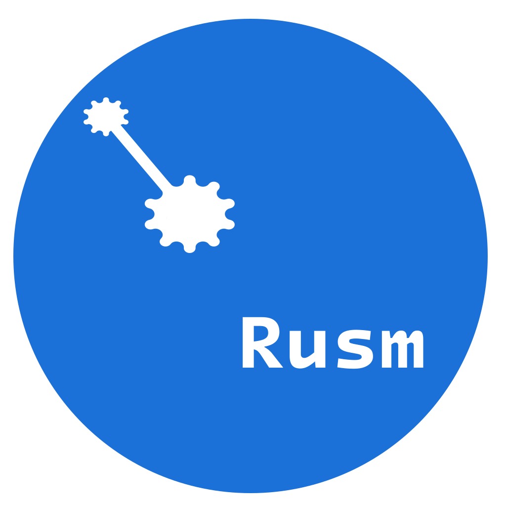

<p align="center">
  
</p>
<h1 align="center">Rusm</h1>
Rusm is a Russian assembly language, featuring full Cyrillic support, translating directly into NASM.


## Features
 - **Full Cross-Platform Support:** Run and compile code seamlessly across different operating systems.
 - **Architecture Support:** Native support for both `x86` (32-bit) and `x86_64` (64-bit) architectures.
 - **Multiple Output Formats:** Full support for generating `ELF`, `WIN` (PE/COFF), `Binary` (Flat binary), and `MACH-O64` executables and object files.
 - **Easy Linking:** Streamlined process for linking object files and system libraries.

## Installation

### Building from source
```bash
git clone https://github.com/gnom2949/rusm.git 
cd rusm
mkdir build
cd build
cmake ..
cmake --build .
sudo cmake --install . # use cmake --install . for windows
```

### Windows
install tarball from Github Releases [page](https://github.com/gnom2949/rusm/releases) or Codeberg Releases [page](https://codeberg.org/gnom2949/rusm/releases)

## Mirrors
Rusm is also available on [GitVerse](https://gitverse.ru/gnom2949/rusm.git)
and [Codeberg](https://codeberg.org/gnom2949/rusm.git)

## License
Copyright(C)2026-present Alexander Silaev.
Licensed under MIT License, see more [in](LICENSE)
